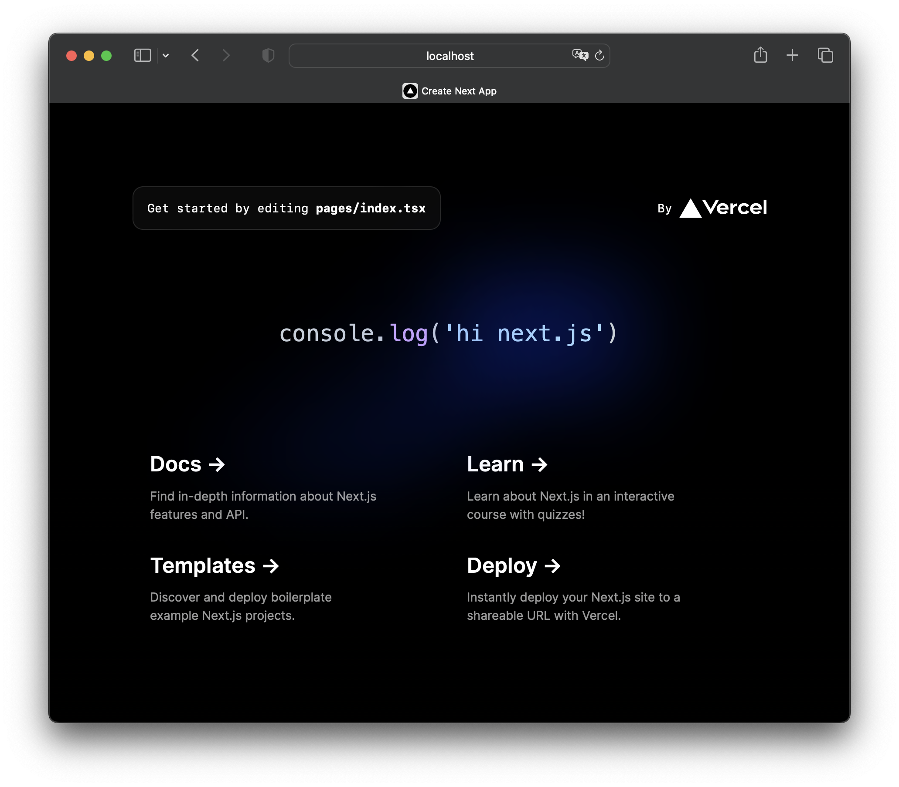

This is a [Next.js](https://nextjs.org/) project bootstrapped with [`create-next-app`](https://github.com/vercel/next.js/tree/canary/packages/create-next-app).

Modified to work with [Shiki](https://github.com/shikijs/shiki).

## Getting Started

First, run the development server:

```bash
npm run dev
```

Open [http://localhost:3000](http://localhost:3000). You should see



## Diffs

Refer to this commit for full diff: [b2639c7](https://github.com/shikijs/next-shiki/commit/b2639c704c0e2eab91c55c08a0419e6b502229eb).

Notably, you need to set `serverComponentsExternalPackages` in `next.config.js`

```diff
/** @type {import('next').NextConfig} */
const nextConfig = {
  reactStrictMode: true,
+  experimental: {
+    serverComponentsExternalPackages: ['shiki', 'vscode-oniguruma']
+  }
}

module.exports = nextConfig
```

`lib/shiki.ts`

```ts
import type { Highlighter, Lang, Theme } from 'shiki'
import { renderToHtml, getHighlighter } from 'shiki'

let highlighter: Highlighter
export async function highlight(code: string, theme: Theme, lang: Lang) {
  if (!highlighter) {
    highlighter = await getHighlighter({
      langs: [lang],
      theme: theme
    })
  }

  const tokens = highlighter.codeToThemedTokens(code, lang, theme, {
    includeExplanation: false
  })
  const html = renderToHtml(tokens, { bg: 'transparent' })

  return html
}
```

`pages/index.tsx`

```tsx
interface Props {
  highlightedHtml: string
}

export default function Home(props: Props) {
  return (
    <>
      <div
        dangerouslySetInnerHTML={{ __html: props.highlightedHtml }}
        style={{ fontFamily: 'var(--font-mono)', fontSize: '2rem' }}
      />
    <>
  )
}

export const getServerSideProps: GetServerSideProps<Props> = async () => {
  const html = await highlight(
    `console.log('hi next.js')`,
    'github-dark',
    'javascript'
  )

  return {
    props: {
      highlightedHtml: html
    }
  }
}
```

## License

MIT © [Pine Wu](https://github.com/octref)
